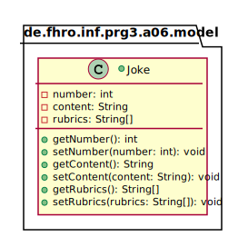
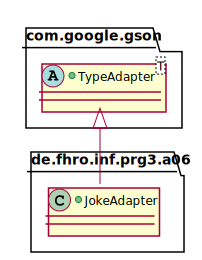

_This is an assignment to the [Software Architecture](https://ohm-softa.github.io) class at the [Technical University of Applied Sciences Nuremberg](http://www.th-nuernberg.de)._


# Assignment 6: Annotations and Reflection
[](https://travis-ci.org/hsro-inf-prg3/06-annotations-reflection)

In this assignment we will use Java annotations and reflection to interact with a remote REST ([Representational State Transfer](https://en.wikipedia.org/wiki/Representational_state_transfer)) API.
As everyone (or maybe just me) loves Chuck Norris jokes we will implement a simple program to get random Chuck Norris jokes from the [ICNDB](http://www.icndb.com/) (**I**nternet **C**huck **N**orris **D**ata**b**ase).


## Setup

1. Create a fork of this repository (button in the right upper corner)
2. Clone the project (get the link by clicking the green _Clone or download button_)
3. Import the project to your IDE (remember the guide in [assignment 1](https://github.com/hsro-inf-prg3/01-tools))
4. Validate your environment by running the tests from your IntelliJ and by running `gradle test` on the command line.


## Gradle and Dependency Management

When we started to use Gradle we already talked about dependency management.
In this assignment we will use Gradle to manage the required libraries.

To complete this assignment you will need the following libraries:

* [Retrofit](http://square.github.io/retrofit/) by Square
* [Gson](https://github.com/google/gson) by Google

With Gradle, project dependencies (both at compile and runtime) are specified in the `build.gradle` file, in the `dependencies` section.
Open the existing [build.gradle](./build.gradle) file and inspect the `dependencies` object (Gradle uses [Groovy](http://groovy-lang.org/), a language similar to Java and Javascript).
Every dependency has a scope where it will be available.
To use a library across the whole project, declare it with the scope `implementation`.

Gradle is designed to help you in all development phases and is extensible by plugins.
In the given `build.gradle` are three plugins already applied:

* `java`: brings Java support to Gradle e.g. compilation)
* `application`: enable you to run and package the application you will develop in this assignment
* `idea`: helps with IntelliJ import

To run the `main` method in the `App` class without IntelliJ you can now use the following Gradle command on the command line:

```bash
gradle run
```


## Overview

The hard part of this assigment is you need to combine three parts to form the whole program:

- Gson for serialization
- Retrofit for HTTP requests
- A Gson type adapter to handle the status of the request response

It is strongly advised to read through the whole assignment and related documentations first; having the complete picture before starting with the parts helps a lot!


## Gson

Google Gson is a library to serialize and deserialize [JSON](https://en.wikipedia.org/wiki/JSON) to or from Java objects.


### Model

The following code snippet shows the structure of a simple JSON object:

```json
{
    "id": 558,
    "joke": "Ghosts are actually caused by Chuck Norris killing people faster than Death can process them.",
    "categories": []
}
```

The most basic use case is to de/serialize objects; by defaut, Gson uses reflection to determine the properties.

```java
class Joke {
  int id;
  String joke;
  String[] categories;
}
```

```java
Gson gson = new Gson();

// JSON String --> Object
Joke j = gson.fromJson("{\"id\": 0, \"joke\": \"Haha.\"}", Joke.class);
// categories remains `null`

// Objec --> JSON String
String json = gson.toJson(j);
```

Gson makes use of annotations to map JSON keys to fields of your class.
Have a look at the [docs](https://github.com/google/gson/blob/master/UserGuide.md) and complete the model described in the following UML:



> Hint: the given JSON object describes the exact structure of the JSON objects we want to deserialize.
> Use anntations to help gson map JSON fields to differently named Java field names.

- Import Gson to your project
- Familiarize yourself with Gson by trying a few examples
- Get familiar with the `@SerializedName` annotation

## Retrofit and Gson

As you could see from the examples above, the actual response body of the ICNDB API looks like the following:

```json
{
  "type": "success",
  "value": {
    "id": 467,
    "joke": "Chuck Norris can delete the Recycling Bin.",
    "categories": [
      "nerdy"
    ]
  }
}
```

The actual joke (`Joke`) is wrapped inside a response object which indicates if the request was successfull.
To be able to unwrap the jokes correctly (or throw an exception if there is no joke) you need to implement a Gson type adapter as shown in the following UML.



In a nutshell, a (Gson) type adapter is responsible to convert Java objects to JSON notation and vice versa.
Key to this transformation is in the implementation of the following two methods:

```java
public abstract class TypeAdapter<T> {
	public abstract T read(final JsonReader reader);
 	public abstract void write(final JsonWriter writer, final T inst);

	// ...
}
```

- Write a type adapter that accepts the response objects from ICNDB and outputs an instance of `Joke`.
- Register the type adapter with your Retrofit instance
Note that you can use annotations on the `Joke` class, but you will have to write custom code to unwrap the joke from the response object.
For this, you have two options:

* Implement a wrapper class, add appropriate fields, and return the `Joke` once unwrapped.
* Unwrap the `Joke` object manually, by using the `reader`'s `.beginObject()`, `.endObject()` and `.next*()` methods.

> Note: There is no need to implement the `write` method, since we're only consuming the API, but not sending to it.

Check out this extensive [tutorial on Gson type adapters](http://www.javacreed.com/gson-typeadapter-example/).


## Retrofit

Retrofit is a great library to implement HTTP clients.
To create an HTTP client, create an interface containing some methods you will call later to perform HTTP requests.
Retrofit also uses annotations to conveniently map these methods to API resource paths, e.g. `getJoke(488, "Bruce", "Wayne")` can be mapped to `GET http://api.icndb.com/jokes/488?firstName=Bruce&lastName=Wayne`.

Read through the [Retrofit documentation](http://square.github.io/retrofit/) and implement the `ICNDBApi` interface as shown in the following UML:


- Start by implementing the method `getRandomJoke()`; use the appropriate annotations to decodate the interface method.
- Modify the `main` method in the `App` class to create an instance of the `ICNDBApi` using `Retrofit.Builder`. You need to add a converter factory that helps converting the JSON response to an object; you can set Gson using `GsonConverterFactory.create()`.
- Print a random joke to `System.out`, and complete the test method `testCollision`. Recall that you work with `Call` objects that need to be executed before you can retrieve the response body.
- After completing the `getRandomJoke()` method try to add the other methods.
- If you are not sure if your query strings are correct you can test them within the command line using `curl` or in a browser extension such as [Postman](https://www.getpostman.com/).

Most unix systems will provide the cURL program:

```bash
curl -X GET "http://api.icndb.com/jokes/random" -H "accept: application/json"
```

On Windows, you can use the PowerShell to accomplish the same like so:

```ps
(Invoke-WebRequest
    -Uri http://api.icndb.com/jokes/random
    -Headers @{"accept"="application/json"}
    ).Content | ConvertFrom-Json | ConvertTo-Json
```

(The part `| ConvertFrom-Json | ConvertTo-Json` is only necessary for formatting.)

_Remark: to execute this command you have to remove the newlines!_
