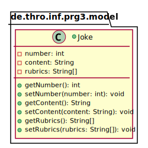
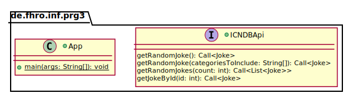

_This is an assignment to the class [Programmieren 3](https://hsro-inf-prg3.github.io) at the [University of Applied Sciences Rosenheim](http://www.fh-rosenheim.de)._

# Assignment 6: Annotations and reflection

In this assignment we will use Java annotations and reflection to interact with a REST ([Representational State Transfer](https://en.wikipedia.org/wiki/Representational_state_transfer)) API.
As everyone (or maybe just me) loves Chuck Norris jokes we want to implement a simple program to get random Chuck Norris jokes from the ICNDB (**I**nternet **C**huck **N**orris **D**ata**b**ase).

## Setup

1. Create a fork of this repository (button in the right upper corner)
2. Clone the project (get the link by clicking the green _Clone or download button_)
3. Import the project to your IDE (remember the guide in [assignment 1](https://github.com/hsro-inf-prg3/01-tools))
4. Validate your environment by running the tests from your IntelliJ and by running `gradle test` on the command line.

## Gradle and dependency management

When we started to use Gradle we already talked about dependency management.
In this assignment we want to use Gradle to get us the required libraries.

To complete this assignment you will need the following libraries:

* [Retrofit](http://square.github.io/retrofit/)
* [Gson](https://github.com/google/gson)

To tell Gradle what you need you have to edit the `build.gradle` file.
Open the existing [build.gradle](./build.gradle) file and inspect the `dependencies` object.
Every dependency has a scope where it will be available.
If you want to use the library in your whole project declare it with the scope `compile` (libraries which are only required in the test cases should be in the scope `testCompile`, there are a few other scopes but these two are enough for now).

Gradle is designed to help you in all development phases and is extensible by plugins.
In the given `build.gradle` are 3 plugins applied:

* _java_ (brings Java support to Gradle e.g. compilation)
* _org.junit.platform.gradle.plugin_ (required to run JUnit5 tests on the command line)
* _application_ (enable you to run and package the application you will develop in this assignment)

To run the `main` method in the `App` class without IntelliJ you can now use the following gradle command on the command line:

```bash
gradle run
```

## Gson

Gson is a library to serialize and deserialize [JSON](https://en.wikipedia.org/wiki/JSON) to or from Java objects.

### Model

The following code snippet shows the structure of a simple JSON object:

```json
{
    "id": 558,
    "joke": "Ghosts are actually caused by Chuck Norris killing people
            faster than Death can process them.",
    "categories": []
}
```

Gson makes use of annotations to enable you to map JSON keys to fields of your class.
Have a look at the [docs](https://github.com/google/gson/blob/master/UserGuide.md) and complete the model described in the following UML:



_Hint: the given JSON object describes the exact structure of the JSON objects we want to deserialize. Due to the fact that the field names do not match you may have to add some annotations._

### TypeAdapter

Unlike the previous JSON snippet, the actual response body of the ICNDB API looks like the following:

```json
{
  "type": "success",
  "value": {
    "id": 467,
    "joke": "Chuck Norris can delete the Recycling Bin.",
    "categories": [
      "nerdy"
    ]
  }
}
```

The actual joke is wrapped in a response object which indicates if the request was successfull.
To be able to deserialize the jokes correctly you have to implement a Gson type adapter as shown in the following UML.


In a nutshell a type adapter is responsible to convert Java objects to JSON notation and vice versa.
If you have no clue how to implement the type adapter have a look [here](http://lmgtfy.com/?s=d&q=gson+type+adapter) or [here](http://www.javacreed.com/gson-typeadapter-example/).

## Retrofit

Retrofit is a great library to implement HTTP clients.
To create a HTTP client you only have to create an interface containing some methods you will call later to execute HTTP calls.
Retrofit also uses annotations to map these methods to decent resource paths (e.g. `getJoke(488, "Bruce", "Wayne");` maps to `GET http://api.icndb.com/jokes/488?firstName=Bruce&lastName=Wayne`).

Have a look at the [docs](http://square.github.io/retrofit/) and implement the `ICNDBApi` interface as shown in the following UML:



Start by implementing the `getRandomJoke()`-method.
To test your interface extend the `main`-method in the `App` class to create an "instance" of the `ICNDBApi` and print a random joke to STDOUT and complete the test method `testCollision`.

When you've completed the `getRandomJoke()`-method and you have some spare time try to add the other methods.

If you are not sure if you're query strings are correct you can test them within the command line.
Nearly every Linux system includes the cURL program which you can use like this:

```bash
curl -X GET "http://api.icndb.com/jokes/random" -H "accept: application/json"
```

If you're still running on Windows you can use the PowerShell to accomplish the same like so:

```ps
(Invoke-WebRequest
    -Uri http://api.icndb.com/jokes/random
    -Headers @{"accept"="application/json"}
    ).Content | ConvertFrom-Json | ConvertTo-Json
```

(The part `| ConvertFrom-Json | ConvertTo-Json` is only necessary for formatting.)

_Remark: to execute this command you have to remove the newlines!_
